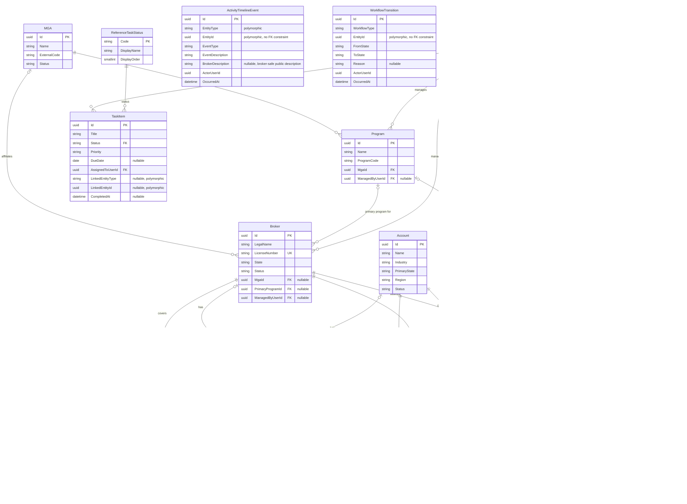

# Nebula CRM — Data Model

**Purpose:** Authoritative data model reference for Nebula CRM. Contains the domain ERD, entity specifications, reference data, query patterns, and migration strategy. Supplements BLUEPRINT.md Section 4.2.

**Last Updated:** 2026-03-03

---

## 0. Domain Entity Relationship Diagram

Reflects all entities implemented as of F0002 (Broker Management). Audit fields (`CreatedAt`, `CreatedByUserId`, `UpdatedAt`, `UpdatedByUserId`, `DeletedAt`, `DeletedByUserId`, `IsDeleted`, `RowVersion`) are present on all `BaseEntity` subclasses and omitted from the diagram for clarity.

### Mermaid ERD



### ASCII Companion

For terminals, PR review comments, and ADR inline use.

```
NEBULA CRM — DOMAIN MODEL (as of F0002)
Audit fields omitted (all BaseEntity subclasses carry: Id, CreatedAt/By, UpdatedAt/By, DeletedAt/By, IsDeleted, RowVersion).

IDENTITY
  UserProfile(Id PK, IdpIssuer, IdpSubject UK, Email, DisplayName, Department, Roles[], Regions[])
     │
     │ manages (opt)           manages (opt)           assigned (req)
     ▼                         ▼                        ▼
  Program ◄──────── MGA        Program                 Submission / Renewal / TaskItem

DISTRIBUTION NETWORK
  MGA(Name, ExternalCode, Status)
   ├─hosts──────────────► Program(Name, ProgramCode, MgaId FK, ManagedByUserId FK opt)
   └─affiliates (opt)──► Broker(LegalName, LicenseNumber UK, State, Status,
                                MgaId FK opt, PrimaryProgramId FK opt, ManagedByUserId FK opt)
                           ├─covers──► BrokerRegion(BrokerId PK+FK, Region PK)
                           └─has────► Contact(FullName, Email, Role, BrokerId FK opt, AccountId FK opt)
  Account(Name, Industry, PrimaryState, Region, Status)
   └─has────────────────► Contact (same Contact table, AccountId FK opt)

WORK ITEMS
  Submission(EffectiveDate, PremiumEstimate, CurrentStatus FK)
   ├─FK (req)──► Account
   ├─FK (req)──► Broker
   ├─FK (opt)──► Program
   ├─FK────────► ReferenceSubmissionStatus(Code PK, IsTerminal, DisplayOrder)
   └─FK────────► UserProfile (AssignedToUserId)

  Renewal(RenewalDate, CurrentStatus FK)
   ├─FK (req)──► Account
   ├─FK (req)──► Broker
   ├─FK (opt)──► Submission (originating)
   ├─FK────────► ReferenceRenewalStatus(Code PK, IsTerminal, DisplayOrder)
   └─FK────────► UserProfile (AssignedToUserId)

TASKS
  TaskItem(Title, Priority, DueDate opt, Status FK, CompletedAt opt)
   ├─FK────────► UserProfile (AssignedToUserId)
   ├─FK────────► ReferenceTaskStatus(Code PK, DisplayOrder)
   └─polymorphic (no FK)──► Broker | Account | Submission | Renewal
                             via (LinkedEntityType, LinkedEntityId)

AUDIT / APPEND-ONLY (no soft delete; polymorphic EntityId — no FK constraint)
  ActivityTimelineEvent(EntityType, EntityId, EventType, EventDescription, BrokerDescription opt, ActorUserId, OccurredAt)
    BrokerDescription: varchar(500) NULL. Populated at event creation for BrokerUser-visible event types
    (BrokerCreated, BrokerUpdated, BrokerStatusChanged, ContactAdded, ContactUpdated) using safe
    predefined templates. NULL for all InternalOnly event types. See F0009 BROKER-VISIBILITY-MATRIX.md.
  WorkflowTransition   (WorkflowType, EntityId, FromState, ToState, Reason opt, ActorUserId, OccurredAt)
```

---

## 1. New Entity: Task

The Task entity is required by Dashboard stories F0001-S0003 (My Tasks & Reminders) and F0001-S0005 (Nudge Cards). It also serves as the foundation for Feature F0003 (Task Center).

See [ADR-003](decisions/ADR-003-task-entity-nudge-engine.md) for design rationale.

### Table: `Tasks`

| Field | Type | Constraints | Default | Description |
|-------|------|-------------|---------|-------------|
| Id | uuid | PK, NOT NULL | gen_random_uuid() | Unique identifier |
| Title | varchar(255) | NOT NULL | — | Task title displayed in widgets |
| Description | varchar(2000) | NULL | — | Optional longer description |
| Status | varchar(20) | NOT NULL, FK -> ReferenceTaskStatus.Code | 'Open' | Current task state |
| Priority | varchar(20) | NOT NULL, CHECK IN ('Low','Normal','High','Urgent') | 'Normal' | Task priority level |
| DueDate | date | NULL | — | Optional due date |
| AssignedToUserId | uuid | NOT NULL, FK → UserProfile.UserId | — | Internal UserId of assigned user (stable across IdP changes) |
| LinkedEntityType | varchar(50) | NULL | — | Type of linked entity: 'Broker', 'Submission', 'Renewal', 'Account' |
| LinkedEntityId | uuid | NULL | — | ID of the linked entity (polymorphic; no hard FK) |
| CreatedAt | timestamptz | NOT NULL | now() | UTC creation timestamp |
| CreatedByUserId | uuid | NOT NULL, FK → UserProfile.UserId | — | Internal UserId of creator |
| UpdatedAt | timestamptz | NOT NULL | now() | UTC last-update timestamp |
| UpdatedByUserId | uuid | NOT NULL, FK → UserProfile.UserId | — | Internal UserId of last updater |
| CompletedAt | timestamptz | NULL | — | Set when Status transitions to Done |
| IsDeleted | boolean | NOT NULL | false | Soft delete flag |

### Indexes

| Index Name | Columns | Type | Purpose |
|-----------|---------|------|---------|
| `PK_Tasks_Id` | Id | PRIMARY KEY, clustered | — |
| `IX_Tasks_AssignedToUserId_Status_DueDate` | (AssignedToUserId, Status, DueDate) | B-tree | My Tasks widget query |
| `IX_Tasks_DueDate_Status` | (DueDate, Status) WHERE IsDeleted = false AND Status != 'Done' | Partial B-tree | Nudge: overdue task detection |
| `IX_Tasks_LinkedEntity` | (LinkedEntityType, LinkedEntityId) | B-tree | Entity-linked task lookups |

### Audit Events

| EventType | Trigger | Payload Fields |
|-----------|---------|---------------|
| TaskCreated | INSERT | title, assignedTo, dueDate, linkedEntityType, linkedEntityId |
| TaskUpdated | UPDATE (non-status) | changedFields |
| TaskCompleted | Status → Done | completedAt |
| TaskReopened | Status Done → Open/InProgress | previousCompletedAt |
| TaskDeleted | IsDeleted → true | — |

See [activity-event-payloads.schema.json](../schemas/activity-event-payloads.schema.json) for full payload JSON Schema definitions, description templates, and the complete event type registry across all entities.

### Seed Data

- **ReferenceTaskStatus** is seeded with: `Open`, `InProgress`, `Done` (deterministic upsert, admin-only writes).
- **No production seed data** for Tasks. Tasks are user-created.
- **Dev/test seed:** Generate 20 tasks per test user using Faker, with varied DueDate spread (past, today, future) to exercise nudge and tasks widget edge cases.

---

## 1.1 MVP Scope Fields (Assignment + Region)

These fields are required to implement MVP ABAC scoping and dashboard assigned-user display without introducing full assignment tables.

- **Accounts:** `Region` (string, required)
- **Brokers:** `ManagedByUserId` (uuid?, FK → UserProfile.UserId)
- **BrokerRegion:** `BrokerId` + `Region` (multi-region broker scope)
- **Programs:** `ManagedByUserId` (uuid?, FK → UserProfile.UserId)
- **Submissions:** `AssignedToUserId` (uuid, FK → UserProfile.UserId), `IsDeleted` (boolean, default false)
- **Renewals:** `AssignedToUserId` (uuid, FK → UserProfile.UserId), `IsDeleted` (boolean, default false)

**Validation rule (MVP):**
- Submission/renewal creation must validate region alignment: `Account.Region` must be included in the broker's `BrokerRegion` set; otherwise return HTTP 400 with `ProblemDetails` (`code=region_mismatch`).

---

## 1.2 Reference Data — Workflow Statuses

BLUEPRINT.md Section 4.2 (line 306) declares `ReferenceSubmissionStatus` and `ReferenceRenewalStatus` as reference tables. This section defines their complete seed values. For allowed transitions between statuses, see BLUEPRINT.md Section 4.3.

### Reference Table Schema

Both tables share the same structure:

| Column | Type | Constraints | Description |
|--------|------|-------------|-------------|
| Code | varchar(30) | PK, NOT NULL | Status identifier (used in `CurrentStatus` fields) |
| DisplayName | varchar(50) | NOT NULL | Human-readable label for UI |
| Description | varchar(255) | NOT NULL | Tooltip/help text |
| IsTerminal | boolean | NOT NULL | `true` = workflow end state; excluded from pipeline views and open counts |
| DisplayOrder | smallint | NOT NULL, UNIQUE | Determines pill ordering in pipeline UI |
| ColorGroup | varchar(20) | NULL | Pipeline pill color category; NULL for terminal statuses |

**ColorGroup values:** `intake`, `triage`, `waiting`, `review`, `decision`. Terminal statuses have no color group (they are excluded from pipeline display).

### ReferenceSubmissionStatus (10 values)

| Code | DisplayName | Description | IsTerminal | DisplayOrder | ColorGroup |
|------|-------------|-------------|------------|--------------|------------|
| Received | Received | Initial state when submission is created | false | 1 | intake |
| Triaging | Triaging | Initial triage and data validation | false | 2 | triage |
| WaitingOnBroker | Waiting on Broker | Awaiting additional information from broker | false | 3 | waiting |
| ReadyForUWReview | Ready for UW Review | All data received, queued for underwriter | false | 4 | review |
| InReview | In Review | Under active underwriter review | false | 5 | review |
| Quoted | Quoted | Quote issued, awaiting broker response | false | 6 | decision |
| BindRequested | Bind Requested | Broker accepted quote, bind in progress | false | 7 | decision |
| Bound | Bound | Policy bound and issued | true | 8 | — |
| Declined | Declined | Submission declined by underwriter | true | 9 | — |
| Withdrawn | Withdrawn | Broker withdrew submission | true | 10 | — |

### ReferenceRenewalStatus (8 values)

| Code | DisplayName | Description | IsTerminal | DisplayOrder | ColorGroup |
|------|-------------|-------------|------------|--------------|------------|
| Created | Created | Renewal record created from expiring policy | false | 1 | intake |
| Early | Early | In early renewal window (90-120 days out) | false | 2 | intake |
| OutreachStarted | Outreach Started | Active broker/account outreach begun | false | 3 | waiting |
| InReview | In Review | Under underwriter review for renewal terms | false | 4 | review |
| Quoted | Quoted | Renewal quote issued | false | 5 | decision |
| Bound | Bound | Policy renewed and bound | true | 6 | — |
| Lost | Lost | Lost to competitor | true | 7 | — |
| Lapsed | Lapsed | Policy expired without renewal | true | 8 | — |

### Allowed Transitions

For the complete allowed transition matrix (which `FromState → ToState` pairs are valid), see [BLUEPRINT.md Section 4.3](../BLUEPRINT.md#43-workflow-rules). Invalid pairs return HTTP 409 (`code=invalid_transition`). Every successful transition appends one `WorkflowTransition` record and one `ActivityTimelineEvent` record.

### Seed Strategy

- Seeded in **Migration 004** alongside `ReferenceTaskStatus` using deterministic idempotent upsert.
- Runtime writes restricted to admin-only actions (per BLUEPRINT.md constraint).
- Dashboard queries use `IsTerminal` to filter: pipeline views show only `WHERE IsTerminal = false`; KPI "open submissions" counts exclude terminal; renewal rate computes over terminal statuses in trailing 90 days.
- Frontend pipeline pills use `DisplayOrder` for ordering and `ColorGroup` for color-coding.

---

## 2. Dashboard-Specific Query Patterns

These query patterns document how dashboard widgets access existing entities defined in BLUEPRINT.md Section 4.2. No schema changes are needed to existing entities — only indexes are added.

### 2.1 KPI Metrics Queries

| Metric | Query Pattern | Required Index |
|--------|--------------|---------------|
| Active Brokers | `SELECT COUNT(*) FROM Brokers WHERE Status = 'Active' AND IsDeleted = false` + ABAC scope | `IX_Brokers_Status` (exists) |
| Open Submissions | `SELECT COUNT(*) FROM Submissions WHERE CurrentStatus NOT IN ('Bound','Declined','Withdrawn')` + ABAC scope | `IX_Submissions_CurrentStatus` (new) |
| Renewal Rate | `SELECT COUNT(CASE WHEN CurrentStatus='Bound') / COUNT(*) FROM Renewals WHERE CurrentStatus IN ('Bound','Lost','Lapsed') AND updated_at > now()-90d` + ABAC scope | `IX_Renewals_CurrentStatus_UpdatedAt` (new) |
| Avg Turnaround | `SELECT AVG(wt.OccurredAt - s.CreatedAt) FROM Submissions s JOIN WorkflowTransition wt ON ... WHERE wt.ToState IN ('Bound','Declined','Withdrawn') AND wt.OccurredAt > now()-90d` | `IX_WorkflowTransition_EntityId_OccurredAt` (new) |

### 2.2 Pipeline Summary Queries

**Submission pipeline counts:**
```sql
SELECT CurrentStatus, COUNT(*)
FROM Submissions
WHERE CurrentStatus NOT IN ('Bound', 'Declined', 'Withdrawn')
  -- + ABAC scope filter
GROUP BY CurrentStatus
```

**Renewal pipeline counts:**
```sql
SELECT CurrentStatus, COUNT(*)
FROM Renewals
WHERE CurrentStatus NOT IN ('Bound', 'Lost', 'Lapsed')
  -- + ABAC scope filter
GROUP BY CurrentStatus
```

### 2.3 Pipeline Popover Mini-Cards (Lazy)

```sql
SELECT
  s.Id,
  COALESCE(a.Name, b.LegalName) AS EntityName,
  s.PremiumEstimate AS Amount,
  EXTRACT(DAY FROM (CURRENT_DATE - wt_latest.OccurredAt)) AS DaysInStatus,
  up.DisplayName AS AssignedUserDisplayName,
  SUBSTRING(up.DisplayName, 1, 2) AS AssignedUserInitials
FROM Submissions s
  LEFT JOIN Accounts a ON s.AccountId = a.Id
  LEFT JOIN Brokers b ON s.BrokerId = b.Id
  LEFT JOIN LATERAL (
    SELECT OccurredAt
    FROM WorkflowTransition wt
    WHERE wt.EntityId = s.Id
      AND wt.WorkflowType = 'Submission'
      AND wt.ToState = s.CurrentStatus
    ORDER BY wt.OccurredAt DESC
    LIMIT 1
  ) wt_latest ON true
  LEFT JOIN UserProfile up ON up.UserId = s.AssignedToUserId
WHERE s.CurrentStatus = @status
  -- + ABAC scope filter
ORDER BY DaysInStatus DESC
LIMIT 5
```

### 2.4 Activity Feed Query

```sql
SELECT
  ate.Id,
  ate.EventType,
  ate.EventPayloadJson,
  ate.OccurredAt,
  b.LegalName AS BrokerName,
  up.DisplayName AS ActorDisplayName,
  ate.EntityId
FROM ActivityTimelineEvent ate
  JOIN Brokers b ON ate.EntityId = b.Id AND ate.EntityType = 'Broker'
  LEFT JOIN UserProfile up ON up.UserId = ate.ActorUserId
WHERE ate.EntityType = 'Broker'
  -- + ABAC scope filter on broker visibility
ORDER BY ate.OccurredAt DESC
LIMIT 20
```

---

## 3. New Indexes on Existing Tables

These indexes are required for dashboard query performance. They do not change any existing table schema.

| Table | Index Name | Columns | Type | Dashboard Use |
|-------|-----------|---------|------|--------------|
| Submissions | `IX_Submissions_CurrentStatus` | (CurrentStatus) WHERE CurrentStatus NOT IN terminal | Partial B-tree | KPI open count, pipeline grouping |
| Submissions | `IX_Submissions_AssignedToUserId_CurrentStatus` | (AssignedToUserId, CurrentStatus) | B-tree | Assigned-scope pipeline + KPI counts |
| Renewals | `IX_Renewals_CurrentStatus` | (CurrentStatus) | B-tree | KPI renewal rate, pipeline grouping |
| Renewals | `IX_Renewals_AssignedToUserId_CurrentStatus` | (AssignedToUserId, CurrentStatus) | B-tree | Assigned-scope pipeline + KPI counts |
| Renewals | `IX_Renewals_RenewalDate_Status` | (RenewalDate, CurrentStatus) | B-tree | Nudge: upcoming renewals |
| WorkflowTransition | `IX_WT_EntityId_OccurredAt` | (EntityId, OccurredAt DESC) | B-tree | DaysInStatus computation, avg turnaround |
| ActivityTimelineEvent | `IX_ATE_EntityType_OccurredAt` | (EntityType, OccurredAt DESC) | B-tree | Broker activity feed |
| Brokers | `IX_Brokers_ManagedByUserId` | (ManagedByUserId) | B-tree | RelationshipManager scope |
| Programs | `IX_Programs_ManagedByUserId` | (ManagedByUserId) | B-tree | ProgramManager scope |
| BrokerRegions | `IX_BrokerRegions_Region_BrokerId` | (Region, BrokerId) | B-tree | Region-scoped broker visibility |
| Accounts | `IX_Accounts_Region` | (Region) | B-tree | Region-scoped account/submission visibility |

---

## 4. Entity Relationship Diagram (Dashboard Context)

See **Section 0** for the full domain ERD (Mermaid + ASCII) covering all implemented entities.

The dashboard consumes a subset of the domain: it aggregates computed KPIs and pipeline counts from `Submission` and `Renewal`, surfaces `TaskItem` records assigned to the current user, and streams `ActivityTimelineEvent` records filtered by entity type. No new tables are introduced for the dashboard itself — it queries existing entities via the indexes defined in Section 3.

---

## 5. Migration Strategy

### EF Core Migration Order (Dashboard-First)

1. **Migration 001:** Add MVP scope fields to existing tables (Brokers, Programs, Submissions, Renewals).
2. **Migration 002:** Create `Tasks` table with all columns and indexes.
3. **Migration 003:** Add dashboard-specific indexes to existing tables (Submissions, Renewals, WorkflowTransition, ActivityTimelineEvent, Brokers, Programs).
4. **Migration 004:** Seed reference data for `ReferenceTaskStatus` (Open, InProgress, Done), `ReferenceSubmissionStatus` (10 values), and `ReferenceRenewalStatus` (8 values). See Section 1.2 for complete seed definitions.

**Decision:** Task Status uses `ReferenceTaskStatus` to align with BLUEPRINT.md reference-table strategy. Task Priority remains a CHECK constraint because it is not admin-configurable in MVP. If Priority becomes configurable later, add `ReferenceTaskPriority` via ADR.

5. **Migration 005 (F0009):** Add `BrokerDescription varchar(500) NULL` to `ActivityTimelineEvents` table. Field is nullable; all existing rows default to NULL. No backfill required — historical events predate BrokerUser access. Source: F0009 security finding F-004 (Option B — split-field sanitization).

---

## Related Documents

- [BLUEPRINT.md Section 4.2](../BLUEPRINT.md) — Core entity definitions
- [ADR-003: Task Entity and Nudge Engine](decisions/ADR-003-task-entity-nudge-engine.md) — Design rationale
- [ADR-002: Dashboard Data Aggregation](decisions/ADR-002-dashboard-data-aggregation.md) — Endpoint structure
- [SOLUTION-PATTERNS.md](SOLUTION-PATTERNS.md) — Audit, ABAC, and repository patterns

---

**Version:** 2.0 — 2026-03-03: Added full domain ERD (Mermaid + ASCII) in Section 0 covering all entities implemented through F0002. Expanded from dashboard-scope supplement to authoritative domain model document.
