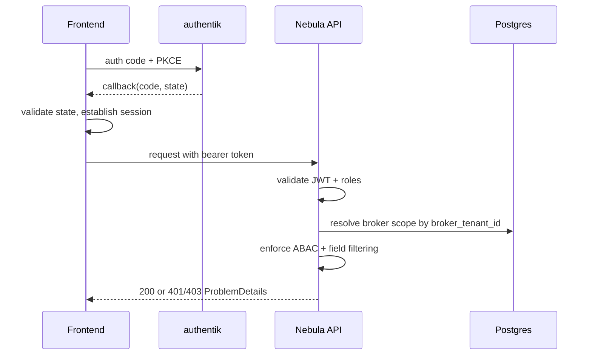

# ADR-007: F0009 Login Flow and Broker Scope Enforcement

**Status:** Accepted  
**Date:** 2026-03-04  
**Owners:** Architect + Security

## Context

F0009 introduces real login and an external BrokerUser role. Existing MVP architecture assumed internal users and dev-token bootstrap. Implementation must be deterministic across routing, session handling, and authorization behavior while preventing broker cross-tenant exposure.

## Decision

1. **OIDC pattern**
   - Use Authorization Code + PKCE with `oidc-client-ts`.
   - Required frontend routes: `/login`, `/auth/callback`, `/unauthorized`.

2. **Deterministic auth outcomes**
   - Unauthenticated access -> `/login`
   - Unauthorized route access -> `/unauthorized`
   - API `401` -> clear session and redirect `/login`
   - API `403` -> stay in context and render permission-safe message

3. **BrokerUser scope resolution**
   - Resolve broker scope via authenticated `broker_tenant_id` claim.
   - Match rule: exactly one active broker tenant mapping for `broker_tenant_id`.
   - Missing claim, no match, or ambiguous match -> deny by default.

4. **Policy and matrix parity**
   - `authorization-matrix.md` section 2.10 is normative.
   - `policy.csv` must carry explicit BrokerUser allow rows for those resources/actions.
   - Any mismatch is release-blocking.

5. **Field-level boundaries**
   - BrokerUser response filtering is server-side mandatory.
   - `InternalOnly` fields must never be emitted to BrokerUser.
   - Enforcement order is fixed:
     1) tenant query isolation
     2) Casbin ABAC decision
     3) DTO/response filtering

## Architecture Sketch (ASCII)

```text
[User] -> [/login] -> [authentik] -> [/auth/callback] -> [Session OK]
   |                                              |
   |                                              v
   +----------------> [API request with token] -> [JWT validate]
                                                 -> [ABAC policy check]
                                                 -> [Broker scope resolve by broker_tenant_id]
                                                 -> [Field filter by visibility class]
                                                 -> [200 | 401 | 403]
```

## Companion Sequence (Mermaid)



## Consequences

Positive:

- Predictable UX and test behavior for login failures and access denial.
- Strong default-deny posture for external BrokerUser.
- Explicit policy artifact parity requirement reduces authorization drift.

Tradeoffs:

- Broker scope depends on correct IdP claim mapping for `broker_tenant_id`.
- Silent renew deferred, so long-lived sessions require explicit re-auth.

## Security Hardening Stance

- RLS is deferred for F0009 Phase 1 to reduce implementation burden.
- Phase 1 compensating controls are mandatory:
  - no raw SQL agent tools
  - ABAC enforcement at API/MCP tool boundary
  - tenant-scoped query filters
  - server-side field filtering
  - auditable policy decisions
- RLS remains a Phase 2 hardening option for highest-risk tenant tables.

## Follow-up

- Implement seeded authentik BrokerUser identities and group mappings.
- Add policy parity validation to CI for matrix vs `policy.csv`.
- Revisit silent renew in future auth hardening story.
