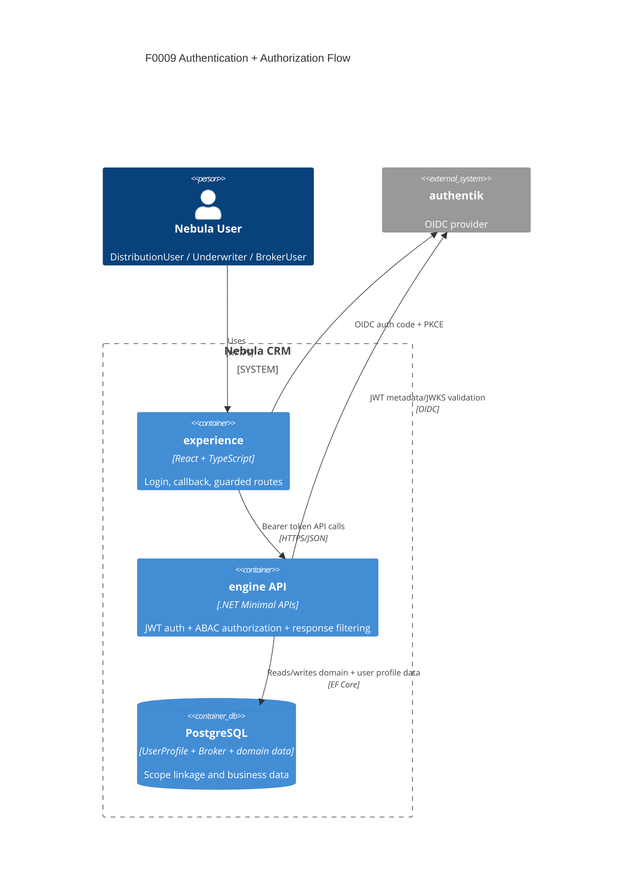
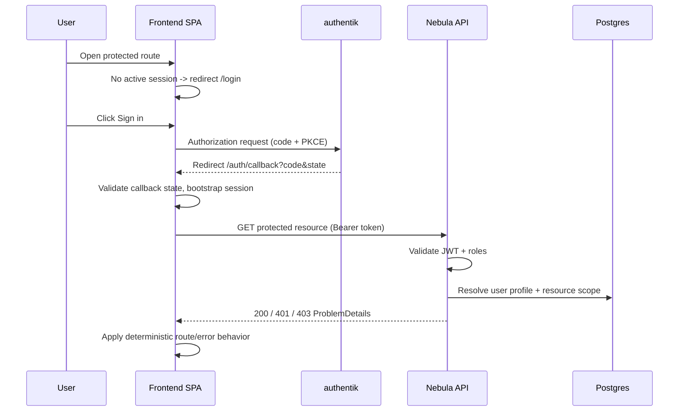

# F0009 Architecture — Authentication and Broker Boundaries

**Owner:** Architect  
**Status:** Draft (Phase B)  
**Last Updated:** 2026-03-04

## 1. Scope

This document defines implementation architecture for:

- Real OIDC login and callback in frontend.
- Session bootstrap and route guards.
- Role-based landing and navigation protection.
- BrokerUser tenant scope and field-level response boundaries.

## 2. Container View (F0009 Delta)

## 3. Runtime Sequence

## 4. Authorization Model (F0009)

- Role claim source: `nebula_roles`.
- Multi-role precedence: `Admin > DistributionManager > DistributionUser > Underwriter > BrokerUser`.
- Route-level checks provide UX gating only.
- API-level ABAC is authoritative.

### BrokerUser Constraints

- Allowed actions/resources come only from:
  - `planning-mds/security/authorization-matrix.md` section 2.10
  - `planning-mds/security/policies/policy.csv` BrokerUser rows
- Default deny if resource/action not explicitly allowed.
- Tenant scope resolution:
  - `Broker.Email` (case-insensitive) must match authenticated `email` claim.
  - Exactly one active broker must match.
  - `0` or `>1` matches => deny.
- Field boundaries enforced server-side per:
  - `planning-mds/features/F0009-authentication-and-role-based-login/BROKER-VISIBILITY-MATRIX.md`

## 5. Route and Session Contracts

Required routes:

- `/login`
- `/auth/callback`
- `/unauthorized`

Deterministic behavior:

- Unauthenticated route access -> `/login`
- Authenticated but unauthorized route -> `/unauthorized`
- API `401` -> clear session + `/login`
- API `403` -> keep context + permission-safe message with `traceId` when present

Session:

- Source of truth: OIDC session (`oidc-client-ts`).
- Silent renew is deferred (not in F0009).
- Expired token path: clear state and redirect `/login?reason=session_expired`.

## 6. Policy Artifact Requirements

F0009 is release-blocked unless all are true:

1. Matrix and policy parity for BrokerUser entries is verified.
2. Broker scope resolution logic implemented in backend services.
3. Server-side response filtering excludes `InternalOnly` fields for BrokerUser.

## 7. Implementation Handoffs

Backend:

- Implement BrokerUser scope filters on broker/contact/dashboard/timeline/task reads.
- Enforce field filtering for BrokerUser response DTOs.
- Keep ProblemDetails semantics for 401/403.

Frontend:

- Implement login + callback + unauthorized routes.
- Add auth mode support (`oidc` primary, `dev` fallback flag only).
- Replace default `getDevToken()` path in real-login mode.

QA:

- Add matrix tests for all three seeded users.
- Add cross-broker deny and InternalOnly field exclusion tests.

DevOps:

- Ensure authentik seed/provisioning includes `BrokerUser` group and required users.

